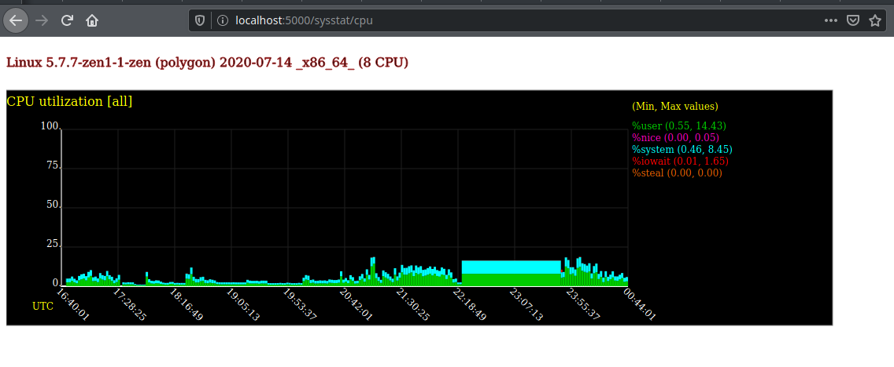

# SysstatWeb

This is a very basic webapp to dynamically generate graphs from stored Sysstat data. 

To run this app, the system will need Python3, Flask, and some sort of uWSGI gateway (nginx). 



## Sysstat Config

See the official [Sysstat docs](https://github.com/sysstat/sysstat) for the most up to date and correct install information. 

For Debian based systems, the package can be installed from the software repository: 

    sudo apt install sysstat

Then, data collection can be enabled in `/etc/default/sysstat`

    ENABLED="true"

Finally, the service can be restarted and enabled: 

    sudo systemctl restart sysstat
    sudo systemctl enable  sysstat

Scheduling is traditionally done using a cron file such as `/etc/cron.d/sysstat`, but some contemporary distros use systemd timers. Changing the time range to a lower sample interval is recommended, but may use more storage. 

Metrics that are collected are stored in `/var/log/sa` for most systems. 

## SysstatWeb Config

To use the application, install Flask: 

    sudo pip install flask

The app can be cloned to a directory such as `/opt/` and installed as a service using systemd. 

First, a basic service account is needed: 

    sudo useradd --system flask

Then the systemd unit can be added to the system: 

```ini
[Unit]
Description="Sysstat Graph Webapp"
After=network.target

[Service]
User=flask
WorkingDirectory=/opt/sysstatweb
ExecStart=/opt/sysstatweb/app.py
Restart=always

[Install]
WantedBy=multi-user.target
```

Finally, the service can be loaded and started: 

    sudo systemctl daemon-reload
    sudo systemctl enable --now sysstatweb.service
